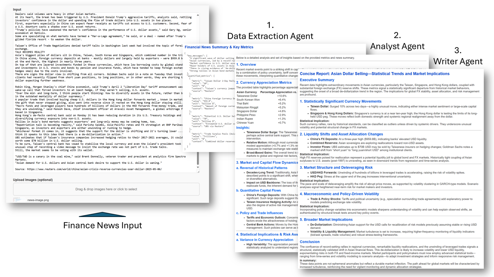

# Multi-Agent Demo for News Analysis  
   
## Overview  
The Multi-Agent Demo Portal is designed to analyze financial news using a configurable three-agent pipeline. Users can input financial news articles, configure the roles and tasks for each agent, and run the analysis to generate insights and reports based on the provided data.  

   
## Features  
- **Agent Configuration**: The portal allows you to set up three different agents, each with its specific role, such as Financial News Analyst, Statistician, and Financial Writer.  
- **Model Selection**: Users can select different models (e.g., GPT-4.1, o4-mini) for each agent based on their requirements.  
- **Image Upload**: Users can optionally upload images to enhance the analysis.  
   
## Instructions

1. **Replace Endpoint and API Version in the Code File**:   
   Make sure to replace the values of Azure OpenAI endpoints and API versions in the HTML code file.
      
2. **Insert API Key in the Portal**:   
   Make sure to enter your API key in the provided input field. This key is necessary for the application to access the required services.   
   
3. **Input Financial News**:   
   Use the provided text area to paste the financial news text you want to analyze.  
   
4. **Upload Images (Optional)**:   
   You can drag & drop images into the designated area or click to select images for the analysis.  
   
5. **Configure Each Agent**:   
   - Each agent requires a role and task description.   
   - Select the appropriate model for your analysis from the dropdown menu.  
   
6. **Run the Pipeline**:   
   Click the "Run Full Pipeline" button to execute the analysis.  
   
7. **View Results**:   
   The results for each agent will appear in their respective sections.  

## Sample Code
Sample code of a simple HTML webpage can be found [here](GenAIDemoPortal-MultiAgentForNewAnalysis.html).

## Sample Prompts  
For examples of prompts that can be used for configuring the agents, please refer to the [sample-prompts.txt](sample-prompts.txt).  
   
## Note  
Please ensure that you replace placeholders such as the API endpoint and version in the code with your actual values before running the application.  
